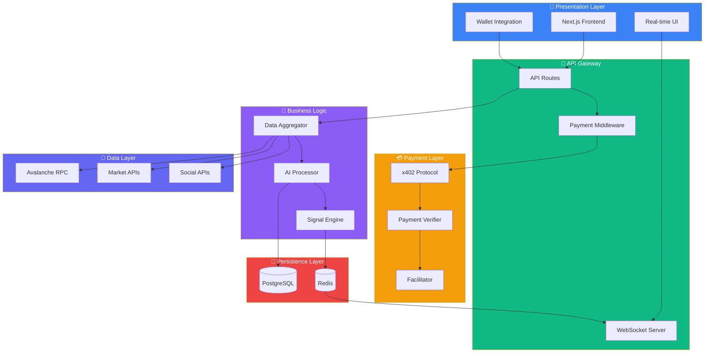
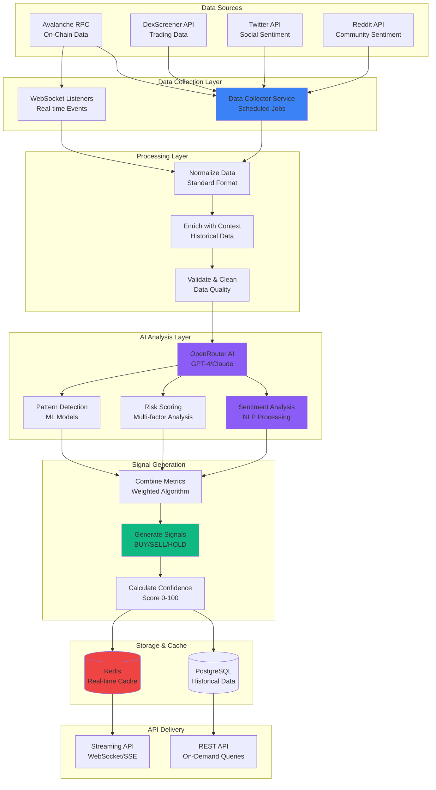

# Avalanche Sentinel - System Architecture

## Overview

Avalanche Sentinel is a real-time AI-powered risk intelligence and sentiment analysis platform for Avalanche tokens, with x402 micro-payment gated access to premium trading signals.

## System Architecture

```mermaid
graph TB
    subgraph Frontend["🌐 Frontend Layer"]
        UI[User Interface]
        WC[Wallet Connection]
        CHARTS[Charts & Dashboard]
    end

    subgraph API["⚙️ API Layer"]
        BASIC_API[/api/token<br/>Basic Data]
        PREM_API[/api/premium<br/>AI Analysis]
        WS_API[/api/realtime<br/>WebSocket/SSE]
    end

    subgraph Payment["💳 Payment System"]
        X402[x402 Handler]
        FACIL[Facilitator Wallet]
    end

    subgraph Data["📊 Data Sources"]
        RPC[Avalanche RPC]
        DS[DexScreener API]
        TW[Twitter API]
        RD[Reddit API]
    end

    subgraph OnChainData["🔗 On-Chain Details"]
        TOKEN_INFO[Token Info<br/>Supply, Decimals]
        HOLDERS[Holder Distribution]
        TRANSACTIONS[Transaction History]
        LIQUIDITY[Liquidity Pools]
        CONTRACT[Smart Contract Data]
        WHALE[Whale Movements]
    end

    subgraph OnChainSentiment["📈 On-Chain Sentiment"]
        BUY_SELL[Buy/Sell Pressure]
        VOLUME[Volume Analysis]
        FLOW[Token Flow Patterns]
        BEHAVIOR[Wallet Behavior]
    end

    subgraph SocialSentiment["💬 Social Media Sentiment"]
        TWITTER_DATA[Twitter/X Data]
        REDDIT_DATA[Reddit Discussions]
        NEWS[News Articles]
    end

    subgraph AI["🤖 AI Analysis Engine"]
        OR[OpenRouter AI]
        ONCHAIN_AI[On-Chain Sentiment AI]
        SOCIAL_AI[Social Sentiment AI]
        COMBINE[Combine Analysis]
        INSIGHTS[Generate Insights]
    end

    subgraph Storage["💾 Storage"]
        DB[(PostgreSQL<br/>Token Data)]
        CACHE[(Redis<br/>Real-time Cache)]
    end

    UI --> WC
    UI --> CHARTS
    UI --> BASIC_API
    UI --> PREM_API

    BASIC_API --> RPC
    BASIC_API --> DS
    BASIC_API --> TOKEN_INFO
    BASIC_API --> HOLDERS
    BASIC_API --> TRANSACTIONS
    BASIC_API --> LIQUIDITY
    BASIC_API --> CONTRACT
    BASIC_API --> WHALE

    PREM_API --> X402
    X402 --> FACIL
    FACIL --> RPC
    
    PREM_API --> ONCHAIN_AI
    PREM_API --> SOCIAL_AI

    RPC --> TOKEN_INFO
    RPC --> HOLDERS
    RPC --> TRANSACTIONS
    RPC --> LIQUIDITY
    RPC --> CONTRACT
    RPC --> WHALE

    RPC --> BUY_SELL
    RPC --> VOLUME
    RPC --> FLOW
    RPC --> BEHAVIOR

    DS --> DB
    TW --> TWITTER_DATA
    RD --> REDDIT_DATA

    TOKEN_INFO --> DB
    HOLDERS --> DB
    TRANSACTIONS --> DB
    LIQUIDITY --> DB
    CONTRACT --> DB
    WHALE --> DB

    BUY_SELL --> ONCHAIN_AI
    VOLUME --> ONCHAIN_AI
    FLOW --> ONCHAIN_AI
    BEHAVIOR --> ONCHAIN_AI

    TWITTER_DATA --> SOCIAL_AI
    REDDIT_DATA --> SOCIAL_AI
    NEWS --> SOCIAL_AI

    ONCHAIN_AI --> OR
    SOCIAL_AI --> OR
    OR --> COMBINE
    COMBINE --> INSIGHTS

    INSIGHTS --> DB
    DB --> CACHE
    CACHE --> WS_API
    WS_API --> CHARTS

    style Frontend fill:#3b82f6,color:#fff
    style API fill:#10b981,color:#fff
    style Payment fill:#f59e0b,color:#fff
    style OnChainData fill:#6366f1,color:#fff
    style OnChainSentiment fill:#8b5cf6,color:#fff
    style SocialSentiment fill:#ec4899,color:#fff
    style AI fill:#f59e0b,color:#fff
    style Storage fill:#ef4444,color:#fff
```

## Layered Architecture



## Data Flow Architecture



## Component Breakdown

### Frontend Layer
- **Next.js Frontend**: React-based UI with Tailwind CSS
- **Wallet Integration**: Thirdweb ConnectButton for wallet connection
- **Real-time Dashboard**: Charts and analytics display

### API Layer
- **`/api/token/:address`**: Free tier - comprehensive token details
- **`/api/premium/:address`**: Premium tier - AI analysis (x402 gated)
- **`/api/realtime`**: WebSocket/SSE for live updates

### Payment System
- **x402 Handler**: Processes payment headers and verifies transactions
- **Facilitator Wallet**: ERC4337 Smart Account for gasless transactions

### Data Collection
- **On-Chain Data**: Token info, holders, transactions, liquidity, contracts, whale activity (Avalanche RPC)
- **Market Data**: Price, volume, liquidity, DEX pairs from DexScreener API
- **Social Media**: Twitter, Reddit, news articles

### AI Processing
- **OpenRouter**: Unified AI API for accessing GPT-4, Claude, and other models
- **On-Chain Sentiment**: Analyzes buy/sell pressure, volume trends, whale behavior
- **Social Sentiment**: Processes social media data for market sentiment
- **Combined Analysis**: Merges both sentiment types for comprehensive insights

### Storage
- **PostgreSQL**: Historical data, token analytics, user payments
- **Redis**: Real-time cache for fast data retrieval

## Technology Stack

- **Frontend**: Next.js 16, React 19, Tailwind CSS, shadcn/ui
- **Blockchain**: Thirdweb SDK v5, Avalanche Network
- **Payment**: x402 Protocol, ERC4337 Smart Accounts
- **Data**: PostgreSQL, Redis
- **AI**: OpenRouter (GPT-4, Claude, etc.)
- **APIs**: DexScreener API, Avalanche RPC, Twitter API, Reddit API

