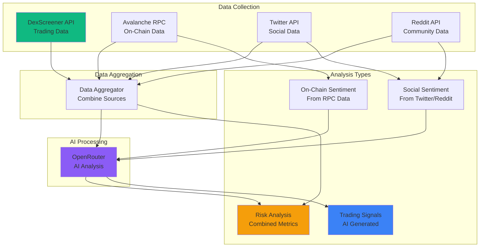

# Avalanche Sentinel - Data Sources

## Overview

This document outlines all data sources used in Avalanche Sentinel for comprehensive token analysis, risk intelligence, and sentiment analysis.

## Primary Data Sources

### 1. CoinGecko API

**Purpose**: Token price, market cap, volume, and price change data

**What We Get**:
- Token price in USD
- Market capitalization
- 24-hour trading volume
- 24-hour price change percentage

**API Endpoint**: `GET /simple/networks/{network}/token_price/{addresses}`

**Network ID**: `avalanche`

**Authentication**: API key in header `x-cg-demo-api-key`

**Environment Variable**: `COINGECKO_API`

**Example Usage**:
```typescript
const response = await fetch(
  `https://api.coingecko.com/api/v3/simple/networks/avalanche/token_price/${tokenAddress}?include_market_cap=true&include_24hr_vol=true&include_24hr_price_change=true`,
  {
    headers: {
      'x-cg-demo-api-key': process.env.COINGECKO_API!,
    },
  }
);
```

**Rate Limits**: 
- Free tier: Limited requests per minute
- Paid tier: Higher limits available

**Documentation**: https://www.coingecko.com/api/documentation

---

### 2. DexScreener API

**Purpose**: Real-time DEX trading data, token pairs, liquidity, and market analytics

**What We Get**:
- Token pair information (price, volume, liquidity)
- Trading analytics (24h/7d volume, price changes)
- Liquidity pool data
- DEX pair discovery
- Price history and charts
- Token profiles

**API Endpoints**:
- `GET /tokens/{chainId}/{tokenAddress}` - Token pairs and data
- `GET /pairs/{chainId}/{pairAddress}` - Specific pair data
- `GET /search?q={query}` - Search tokens

**Documentation**: https://docs.dexscreener.com/

**Example Usage**:
```typescript
// Fetch token data from DexScreener
const response = await fetch(
  `https://api.dexscreener.com/latest/dex/tokens/${tokenAddress}`
);
const data = await response.json();
// Returns: pairs, price, volume, liquidity, etc.
```

**Data Provided**:
- ✅ Token price (current, 24h change)
- ✅ Trading volume (24h, 7d)
- ✅ Liquidity depth
- ✅ DEX pairs (Trader Joe, Pangolin, etc.)
- ✅ Price history
- ✅ Market cap (if available)
- ✅ Holder count (if available)

**Limitations**:
- Rate limits apply (check DexScreener docs)
- Some data may require paid tier
- Real-time updates may have slight delay

---

### 3. OpenRouter AI

**Purpose**: AI-powered sentiment analysis and risk intelligence

**What We Get**:
- Sentiment analysis of social media content
- Risk assessment based on multiple factors
- Trading signal generation
- Natural language processing
- Pattern recognition

**Models Available**:
- GPT-4, GPT-3.5 (OpenAI)
- Claude (Anthropic)
- Gemini (Google)
- Llama, Mistral (Open source)

**API Endpoint**: `POST https://openrouter.ai/api/v1/chat/completions`

**Documentation**: https://openrouter.ai/docs

**Example Usage**:
```typescript
const response = await fetch('https://openrouter.ai/api/v1/chat/completions', {
  method: 'POST',
  headers: {
    'Authorization': `Bearer ${OPENROUTER_API_KEY}`,
    'Content-Type': 'application/json',
  },
  body: JSON.stringify({
    model: 'openai/gpt-4',
    messages: [
      {
        role: 'system',
        content: 'You are an expert cryptocurrency risk analyst...'
      },
      {
        role: 'user',
        content: `Analyze this token data: ${tokenData}`
      }
    ]
  })
});
```

**Use Cases**:
1. **On-Chain Sentiment Analysis**:
   - Analyze transaction patterns
   - Interpret whale behavior
   - Assess buy/sell pressure

2. **Social Media Sentiment**:
   - Process Twitter/X mentions
   - Analyze Reddit discussions
   - Evaluate news articles

3. **Risk Scoring**:
   - Combine multiple data points
   - Generate risk score (0-100)
   - Provide risk factors

4. **Trading Signals**:
   - Generate BUY/SELL/HOLD signals
   - Calculate confidence scores
   - Provide reasoning

---

### 4. Avalanche RPC (Direct Blockchain Access)

**Purpose**: On-chain data not available through DexScreener

**What We Get**:
- Token contract information
- Holder distribution (top holders)
- Transaction history
- Smart contract code analysis
- Wallet balances
- Token transfers

**RPC Providers**:
- Avalanche Public RPC
- Infura (Avalanche)
- QuickNode
- Alchemy (if supporting Avalanche)

**Example Usage**:
```typescript
// Using ethers.js or viem
import { createPublicClient, http } from 'viem';
import { avalanche } from 'viem/chains';

const client = createPublicClient({
  chain: avalanche,
  transport: http('https://api.avax.network/ext/bc/C/rpc')
});

// Get token holder count
const tokenContract = await client.readContract({
  address: tokenAddress,
  abi: ERC20_ABI,
  functionName: 'totalSupply'
});
```

**Data Provided**:
- ✅ Token supply (total, circulating)
- ✅ Holder distribution
- ✅ Transaction history
- ✅ Smart contract details
- ✅ Token transfers
- ✅ Wallet balances

---

### 5. Social Media APIs

**Purpose**: Social sentiment data for AI analysis

#### Twitter/X API

**What We Get**:
- Tweets mentioning token
- Hashtag tracking
- User engagement metrics
- Trending topics

**API**: Twitter API v2

**Example Usage**:
```typescript
const response = await fetch(
  `https://api.twitter.com/2/tweets/search/recent?query=${tokenSymbol}`,
  {
    headers: {
      'Authorization': `Bearer ${TWITTER_BEARER_TOKEN}`
    }
  }
);
```

#### Reddit API

**What We Get**:
- Subreddit posts
- Comments and discussions
- Upvote/downvote ratios
- Community activity

**API**: Reddit JSON API (public) or Reddit API v1

**Example Usage**:
```typescript
const response = await fetch(
  `https://www.reddit.com/r/cryptocurrency/search.json?q=${tokenSymbol}&sort=hot`
);
```

#### News APIs (Optional)

**Sources**:
- CryptoCompare News API
- NewsAPI
- CryptoPanic

---

## Data Flow Architecture



## Data Source Breakdown by Feature

### Free Tier (Basic Token Details)

| Data Point | Source | Endpoint/Method |
|------------|--------|-----------------|
| Token Price | DexScreener | `/tokens/{chainId}/{address}` |
| 24h Volume | DexScreener | `/tokens/{chainId}/{address}` |
| Liquidity | DexScreener | `/tokens/{chainId}/{address}` |
| DEX Pairs | DexScreener | `/tokens/{chainId}/{address}` |
| Token Supply | Avalanche RPC | `readContract('totalSupply')` |
| Holder Count | Avalanche RPC | Indexer or Subgraph |
| Contract Address | User Input | - |
| Token Name/Symbol | Avalanche RPC | `readContract('name', 'symbol')` |

### Premium Tier (AI Analysis)

| Analysis Type | Data Sources | AI Processing |
|---------------|--------------|---------------|
| **On-Chain Sentiment** | Avalanche RPC (transactions, flows) | OpenRouter GPT-4 |
| **Social Sentiment** | Twitter API, Reddit API | OpenRouter GPT-4 |
| **Risk Score** | DexScreener + RPC + Social | OpenRouter GPT-4 |
| **Trading Signals** | All combined data | OpenRouter GPT-4 |
| **Whale Analysis** | Avalanche RPC (large transactions) | OpenRouter GPT-4 |

## API Rate Limits & Costs

### DexScreener
- **Free Tier**: Limited requests per minute
- **Paid Tier**: Higher rate limits
- **Recommendation**: Cache data, use WebSocket if available

### OpenRouter
- **Pricing**: Pay per token (varies by model)
- **Models**: GPT-4 (~$0.03/1K tokens), GPT-3.5 (~$0.002/1K tokens)
- **Recommendation**: Use GPT-3.5 for simple tasks, GPT-4 for complex analysis

### Avalanche RPC
- **Public RPC**: Rate limited, may be slow
- **Paid RPC**: Infura, QuickNode (better performance)
- **Recommendation**: Use paid RPC for production

### Social Media APIs
- **Twitter**: Free tier limited, paid tier available
- **Reddit**: Public API (rate limited)
- **Recommendation**: Implement caching and rate limiting

## Implementation Strategy

### 1. Data Collection Priority

**Tier 1 (Essential)**:
- DexScreener API (trading data)
- Avalanche RPC (on-chain data)
- OpenRouter (AI analysis)

**Tier 2 (Important)**:
- Twitter API (social sentiment)
- Reddit API (community sentiment)

**Tier 3 (Optional)**:
- News APIs
- Telegram/Discord bots

### 2. Caching Strategy

- **DexScreener Data**: Cache for 30-60 seconds (real-time trading)
- **RPC Data**: Cache for 5-10 minutes (on-chain changes slower)
- **Social Data**: Cache for 15-30 minutes (sentiment changes gradually)
- **AI Analysis**: Cache for 1-5 minutes (expensive to regenerate)

### 3. Error Handling

- Implement retry logic for all API calls
- Fallback to cached data if APIs fail
- Graceful degradation (show available data)
- User-friendly error messages

## Environment Variables

```env
# CoinGecko
COINGECKO_API=your_coingecko_api_key

# OpenRouter
OPENROUTER_API_KEY=your_openrouter_api_key

# DexScreener (if API key required - usually not needed)
DEXSCREENER_API_KEY=your_key_here

# Avalanche RPC
AVALANCHE_RPC_URL=https://api.avax.network/ext/bc/C/rpc
# Or use paid provider:
# AVALANCHE_RPC_URL=https://avalanche-mainnet.infura.io/v3/YOUR_KEY

# Twitter API
TWITTER_BEARER_TOKEN=your_token_here

# Reddit API (usually no key needed for public)
REDDIT_CLIENT_ID=your_client_id
REDDIT_CLIENT_SECRET=your_secret
```

## Payment Structure

**Single Payment Gate**: $0.05 USDC

Both token data collection and AI analysis are gated behind a single $0.05 payment. Users pay once to get:
- Complete token data (price, volume, market cap, on-chain metrics)
- AI-powered risk analysis
- Trading recommendation
- Risk score breakdown

## Next Steps

1. ✅ Set up CoinGecko API access
2. ✅ Set up DexScreener API access (no key needed for basic)
3. ✅ Set up OpenRouter account and API key
4. ✅ Configure Avalanche RPC connection
5. ⏳ Set up Twitter API (if using)
6. ⏳ Set up Reddit API (if using)
7. ⏳ Implement data aggregation layer
8. ⏳ Implement caching layer
9. ⏳ Integrate OpenRouter for AI analysis
10. ⏳ Implement on-chain data fetching

