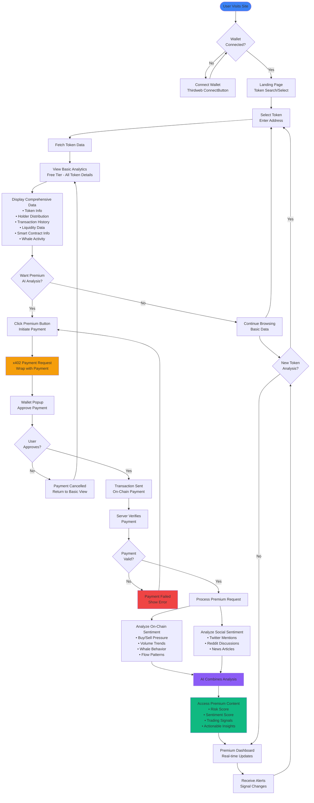
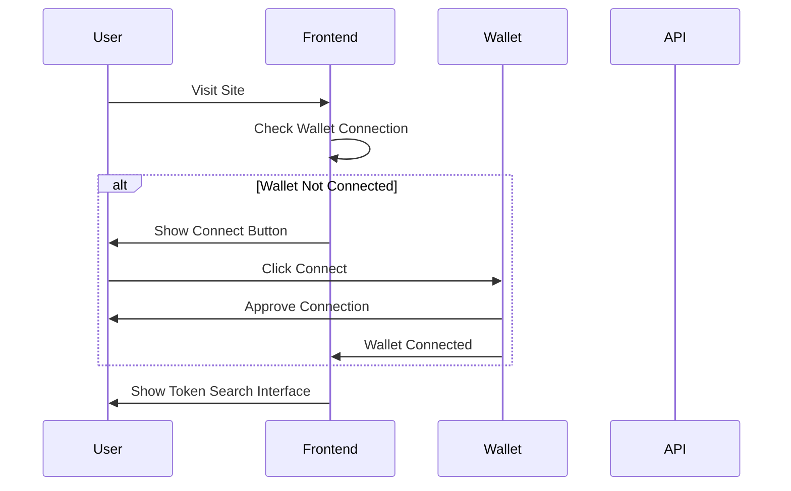
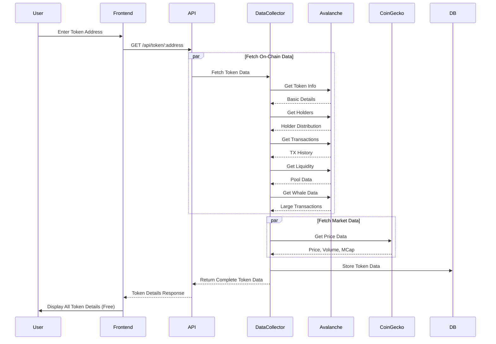
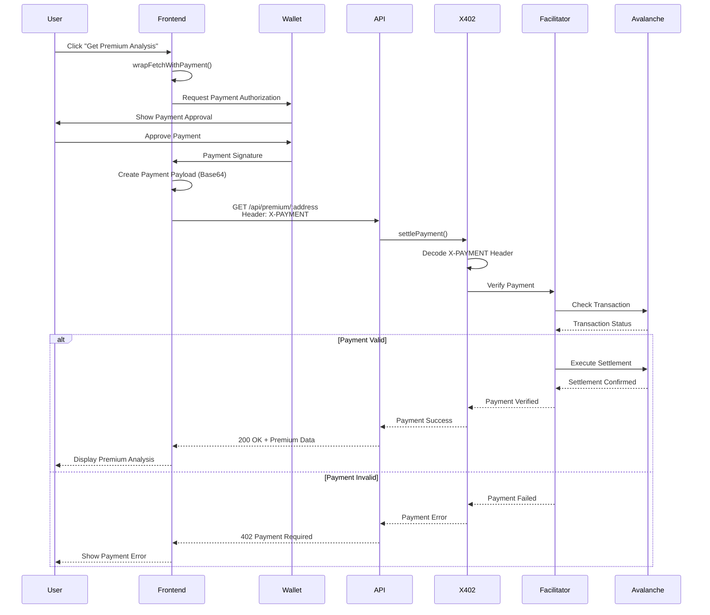
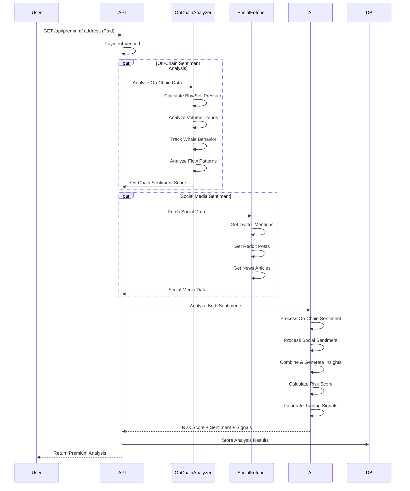
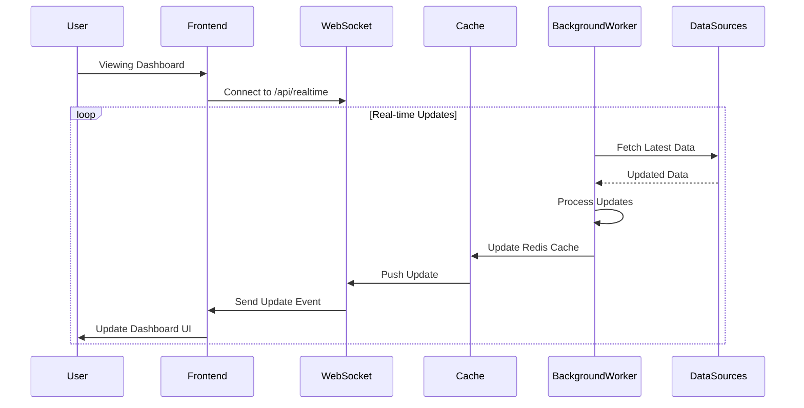

# Avalanche Sentinel - User Flow

## Overview

This document describes the complete user journey through the Avalanche Sentinel platform, from initial access to receiving premium AI-powered trading signals.

## Main User Flow

## Detailed User Journey

### 1. Initial Access

### 2. Token Analysis Flow

### 3. Premium Payment Flow

### 4. Premium Analysis Flow

### 5. Real-time Updates Flow

## User Flow States

### State 1: Unauthenticated
- User visits site
- Must connect wallet to proceed
- Shows connection prompt

### State 2: Authenticated - Free Tier
- Wallet connected
- Can search and view token details
- Access to comprehensive token data (free)
- Can see all on-chain information

### State 3: Premium Request
- User clicks premium button
- Payment prompt appears
- User approves payment in wallet
- Payment transaction sent

### State 4: Premium Access
- Payment verified
- AI analysis processing
- Premium dashboard displayed
- Real-time updates enabled

## Key User Actions

1. **Connect Wallet**: Required to access any features
2. **Search Token**: Enter token address to view details
3. **View Basic Data**: Free access to all token information
4. **Request Premium**: Click to get AI analysis (requires payment)
5. **Approve Payment**: Confirm payment in wallet
6. **View Premium Analysis**: Access risk scores and trading signals
7. **Monitor Updates**: Real-time dashboard updates

## Error Handling

- **Wallet Connection Failed**: Show retry option
- **Payment Cancelled**: Return to basic view
- **Payment Failed**: Show error message, allow retry
- **Token Not Found**: Show error, allow new search
- **API Error**: Show user-friendly error message

